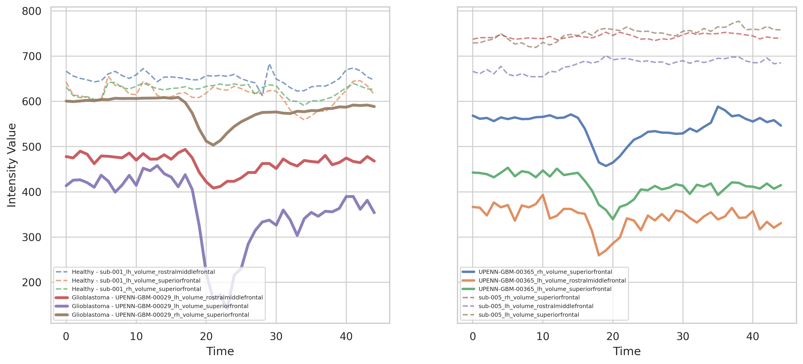

# Integrative Analysis of Imaging Data and Genomic Profiles in Glioblastoma Diagnosis

MSc thesis, African Institute for Mathematical Sciences (AIMS) Ghana — submitted June 2025.
Supervisors: Dr. Reindorf Nartey Borkor and Dr. Chipo Zidana.

This repository contains the code and processed data for a pipeline that links gene expression associated with glioblastoma to specific brain regions, extracts imaging features from those regions in 4D MRI, and uses them to classify glioblastoma against healthy controls.

It also contains a review of the work carried out after submission, which identified a confound and three validation errors. Both the original result and that review are documented below.

---

## The question

Glioblastoma is diagnosed using MRI and biopsy, and classified using molecular markers. These two sources of information are usually analysed separately. This project asked whether gene-level information could be used to decide *where in the brain to look* — mapping differentially expressed genes to cortical regions, then extracting imaging features only from those regions, rather than from the whole brain or from a manually chosen area.

## Pipeline

The analysis ran in four stages across three environments — R for the genomics, bash for the imaging preprocessing, and Python notebooks for feature extraction and modelling.

### Stage 1 — Gene extraction and differential expression (`R/`)

Expression matrices were extracted from the two GEO series and aligned on their common probe sets (`01_gene_extraction.R`, `02_tcga_gbm_genes.R`, `03_normal_gene_sample.R`).

`04_gene_analysis.R` then ran a Welch's t-test across the 10,695 probe sets common to both datasets, with log2 fold change and Benjamini-Hochberg correction for multiple testing. Probe sets with adjusted p < 0.05 and |log2FC| > 1 were taken as significant, giving **381 differentially expressed probe sets**.

The top 350 were submitted to the NeuroimaGene R package against the Desikan-Killiany atlas, with BH correction. Only **20 of the 350 were present in the NeuroimaGene database**, producing 696 gene-region associations across 82 unique brain region phenotypes (`results/NextF350_results.csv`). Volume-based phenotypes were prioritised, since the imaging data is 4D.

### Stage 2 — Imaging preprocessing (`scripts/`)

Run from the terminal, separately for the glioblastoma and control cohorts:

| Script | Does |
|---|---|
| `01_convert_dicom_to_nifti.sh` | DICOM to NIfTI conversion (glioblastoma scans; the control scans arrived as NIfTI) |
| `02_reorient_gbm.sh`, `03_reorient_controls.sh` | Reorientation to standard anatomical space |
| `04_extract_first_volume_controls.sh` | Extraction of a representative 3D volume from the 4D series, via FSL `fslroi` |
| `05_run_fastsurfer_gbm.sh`, `06_run_fastsurfer_controls.sh` | FastSurfer segmentation and regional labelling against the Desikan-Killiany atlas |

Preprocessing used FSL throughout: `fslreorient2std` for reorientation, `fslroi` for volume extraction, and `bet` for brain extraction. The same steps were applied to both cohorts — the intermediate outputs confirm it — but the glioblastoma equivalents of the volume-extraction and masking scripts were not kept, so only the control versions appear here.

Brain extraction was run on both cohorts and then not used downstream. It turned out to be unnecessary: features are extracted from atlas-defined cortical regions, so non-brain tissue never enters a region of interest. It would only have mattered for a whole-brain analysis.

### Stage 3 — Region alignment and feature extraction (`notebooks/01`, `notebooks/02`)

Nilearn was used to align the 4D scans to the 3D segmentations and extract voxel intensities from the regions of interest. Regional mean intensity was recorded at each timepoint, giving one time series per subject-region (`data/processed/region_timeseries/`).

TSFresh then summarised each time series into six static features: mean, standard deviation, skewness, kurtosis, absolute energy, and autocorrelation at lag 1. Static summaries were needed because the classifiers could not consume full time series.

### Stage 4 — Classification (`notebooks/03_ml_process.ipynb`)

Logistic Regression, Random Forest, and an RBF-kernel SVM, all with `class_weight="balanced"` to handle the class imbalance.

## Data

Raw imaging data is **not** included here — it is large and publicly hosted. Processed feature files are included so the modelling stage can be run directly.

| Source | Accession | Used for | In repo |
|---|---|---|---|
| GEO | [GSE83130](https://www.ncbi.nlm.nih.gov/geo/query/acc.cgi?acc=GSE83130) | Glioblastoma expression (45 samples; Affymetrix HT HG-U133A) | Processed extract only |
| GEO | [GSE50161](https://www.ncbi.nlm.nih.gov/geo/query/acc.cgi?acc=GSE50161) | Healthy brain expression (13 samples; Affymetrix U133 Plus 2.0) | Processed extract only |
| TCIA | [UPENN-GBM](https://doi.org/10.7937/TCIA.709X-DN49) | Glioblastoma 4D EPI perfusion MRI | No — fetch from TCIA |
| OpenNeuro | [ds000243](https://openneuro.org/datasets/ds000243) (WU120) | Healthy 4D resting-state BOLD MRI | No — fetch from OpenNeuro |

## Repository structure

```
R/                          gene extraction and differential expression
scripts/                    imaging preprocessing (bash, run per cohort)
notebooks/                  region alignment, feature extraction, modelling
data/processed/
├── GBM_Genes.csv           expression matrix, glioblastoma samples
├── Normal_Genes.csv        expression matrix, healthy samples
└── region_timeseries/      one CSV per subject: regional mean intensity per timepoint
results/                    NeuroimaGene gene-region associations
figures/                    figures as they appear in the thesis
```

Six files in `region_timeseries/` are empty — `UPENN-GBM-00143`, `00174`, `00322`, `00459`, `00473` and `00618`. These are the six glioblastoma scans in which FastSurfer identified none of the ten target regions. They are kept in place rather than deleted, since the attrition is part of the result.

## What survived each stage

The dataset shrank at every step, and the size of that attrition is part of the result:

| Stage | In | Out |
|---|---|---|
| Common probe sets tested | 10,695 | 381 significant |
| Submitted to NeuroimaGene | 350 | 20 found in database |
| Target brain regions | 10 | 3 present across all subjects |
| Subjects with usable segmentation | 20 GBM + healthy | 33 total |
| Planned imaging features | full radiomics (shape, texture, first-order) | mean intensity only |

FastSurfer failed to identify **any** of the ten target regions in six of twenty glioblastoma scans, and the regions it did find varied unpredictably between subjects. Only three regions were present across all remaining subjects, so the analysis was restricted to those. Compute limits ruled out the shape and texture features originally planned.

Final feature matrix: **99 rows** (one per subject-region) **× 6 features**, from 33 subjects.

## Results as reported

Classification of glioblastoma against healthy, 75/25 train-test split.

| Model | Test accuracy | Recall | F1 | PR-AUC |
|---|---|---|---|---|
| Logistic Regression | 0.960 | 1.000 | 0.952 | 0.955 |
| Random Forest | 0.960 | 0.900 | 0.947 | 0.970 |
| SVM (RBF) | 0.960 | 0.900 | 0.947 | 0.970 |

Stratified 5-fold cross-validation gave mean recall of 0.950 (LR), 0.943 (RF), 0.925 (SVM).

In the Logistic Regression model, **standard deviation of regional mean intensity was by far the strongest predictor**, with an odds ratio of 5.835. Mean (0.331) and skewness (0.311) were associated with lower odds of glioblastoma.

---

## Limitations and post-submission review

The thesis identified the use of separate patient cohorts as a primary limitation. Reviewing the work afterwards, I found the specific mechanism behind that limitation, plus three errors in how the models were validated. They are recorded here because the numbers above should not be read without them.

### 1. The two groups were imaged with different sequences, and one used contrast

This is the serious one.

The glioblastoma scans are dynamic susceptibility contrast (DSC) perfusion MRI. DSC works by injecting a gadolinium bolus and recording the signal drop as it passes through tissue, followed by recovery. The healthy scans are resting-state BOLD, acquired with no contrast agent at all.

That difference is visible directly in the data in this repository, and in the figure below — thick lines are glioblastoma subjects, dashed lines are healthy controls.



In the raw files: Every glioblastoma time series in `data/processed/region_timeseries/` shows a sharp drop around timepoint 15–20 followed by recovery — for example `UPENN-GBM-00004` falls from roughly 580 to 52 and climbs back to around 400. No healthy subject file shows this. They are comparatively flat throughout.

A bolus dip of that size inflates standard deviation, kurtosis and absolute energy, and alters autocorrelation. Standard deviation was the model's strongest predictor. **The classifier may therefore be separating scans that used a contrast agent from scans that did not, rather than separating disease from health** — and every glioblastoma subject had contrast while no healthy subject did, so the two are perfectly confounded.

I have not verified per-subject acquisition parameters, so this is a well-supported explanation rather than a proven one. But it is sufficient reason not to read the accuracy figures as evidence of diagnostic performance.

The underlying cause was that paired imaging and expression data for the same subjects was not available at the time, forcing the use of two unrelated public cohorts.

### 2. The train-test split leaked across subjects

The feature matrix has 99 rows from 33 subjects, since each subject contributes up to three regions. `train_test_split` was applied to those 99 rows at random, so a subject's other regions could appear in both the training and test sets. Some of the reported performance may reflect the model recognising subjects rather than the condition.

The correct approach is grouped splitting — `GroupKFold` or `GroupShuffleSplit` with subject ID as the group.

### 3. The scaler was fitted before cross-validation

`StandardScaler` was fitted on the full feature matrix, and the scaled result was then passed into the cross-validation loop. Test-fold statistics therefore influenced the scaling. (The single holdout split does this correctly — fitted on train, applied to test.) The fix is to put the scaler inside a `Pipeline` so it refits within each fold.

### 4. PR-AUC was computed on predicted labels

`precision_recall_curve` was called with predicted class labels rather than predicted probabilities. A precision-recall curve needs continuous scores to sweep the decision threshold; with binary labels there are only two points, so the reported PR-AUC values are not meaningful threshold sweeps. The probabilities were already computed and should have been passed instead.

### 5. Minor: an undocumented cutoff

350 of the 381 significant genes were submitted to NeuroimaGene, with no rationale stated in the thesis. Given that only 20 genes matched the database, this cutoff is unlikely to have changed the outcome — but there was no reason for it, and it should have been all 381 or an explained subset.

---

## What I would do differently

Use cases and controls from the same acquisition protocol. That single change matters more than all the code fixes combined, because no amount of correct validation rescues a design where the label is perfectly correlated with the scanner.

Beyond that: grouped splitting on subject ID, scaling inside a pipeline, PR-AUC from probabilities, and a stated rationale for any filtering step.

## Reproducing

```bash
pip install -r requirements.txt
```

The modelling stage in `notebooks/ml_process.ipynb` runs directly from `data/processed/region_timeseries/`. The imaging preprocessing stage requires the raw scans from TCIA and OpenNeuro, plus FastSurfer.

## Citing

Quartey, B. N. K. (2025). *Integrative Analysis of Imaging Data and Genomic Profiles in Glioblastoma Diagnosis.* MSc essay, African Institute for Mathematical Sciences, Ghana.
